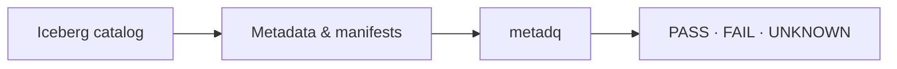

# metadq

[](https://github.com/keemgdeok/metadq/releases)
[](https://github.com/keemgdeok/metadq/actions/workflows/ci.yml)
[](https://adoptium.net/temurin/releases/)

**Fast, conservative data-quality checks for Apache Iceberg—without Spark or
data-file scans.**

| Metadata-only | Standalone | Automation-ready |
| --- | --- | --- |
| Reads metadata and manifests | One Java CLI; no Spark or service | Text/JSON and documented exit codes |

> **Status:** v0.1.0 early release. External Iceberg-user validation is limited.

## Quick start

Java 17 or newer is required.

```console
curl -LO https://github.com/keemgdeok/metadq/releases/download/v0.1.0/metadq.jar
java -jar metadq.jar doctor --demo
```

The demo runs against an in-memory Iceberg v2 table and never opens content
data files.

```text
TABLE      demo.events
FORMAT     v2
FILES      3 data, 0 delete, 6144 bytes referenced
ROWS       1200 before deletes (according to Iceberg metadata)
NOTE       column.null_ratio(user_id) is not ready: null counts cover 2/3 files
GUARD      No content data files opened.
```

## How it works



`metadq` is a read-only Java CLI with two commands:

- `doctor` explains which metadata evidence is available.
- `check` evaluates four conservative rules for CI and orchestration.

## Rules and results

| Rule | Checks |
| --- | --- |
| `table.row_count` | Sum of live data-file record counts |
| `column.null_ratio` | Null ratio when top-level column metrics are complete |
| `table.last_commit_age` | Snapshot commit recency, not event-time freshness |
| `schema.column` | Top-level column presence, type, and nullability |

Results are `PASS`, `FAIL`, or `UNKNOWN`. `UNKNOWN` means the metadata cannot
prove either outcome—for example, because metrics are incomplete or applicable
delete files exist. Operational and configuration errors return `ERROR`.

Overall exit codes are `0` when all rules pass, `1` for any failure, `2` for an
error, and `3` for an unknown result when there is no failure or error.

## Connect a REST catalog

Configure the included examples, then run `doctor` or `check` against one
table:

```console
cp examples/catalog.properties.example catalog.properties
cp examples/metadq.yml metadq.yml

java -jar metadq.jar doctor \
  --catalog-properties catalog.properties \
  --table analytics.events

java -jar metadq.jar check \
  --catalog-properties catalog.properties \
  --table analytics.events \
  --rules metadq.yml
```

Both commands support `--format text` and `--format json`. For a reproducible
MinIO and Iceberg REST Catalog environment, see the
[local end-to-end guide](docs/E2E.md).

## Performance

The 100,000-live-file results from the documented Apple M4 reference run are:

| Requested column statistics | Median runtime | Peak heap |
| --- | ---: | ---: |
| None | 75 ms | 71 MiB |
| 1 column | 81 ms | 128 MiB |
| 10 columns | 127 ms | 247 MiB |

These are in-memory metadata timings, not a comparison with a data-row scan.
See the [benchmark methodology and full results](docs/BENCHMARK.md) for the 1k,
10k, and 100k file runs.

## Scope

- Reads Iceberg metadata JSON, manifest lists, and manifests only.
- Supports Iceberg format v1 and v2; v3 is rejected.
- Packages REST-catalog support and `S3FileIO` for S3/S3-compatible storage.
- Never modifies tables or opens Parquet, ORC, or Avro content data files.

Results describe what the current Iceberg metadata establishes. They do not
independently verify that source writers produced correct metrics.

See [the product contract](docs/DESIGN.md) for detailed semantics and limitations,
and [the roadmap](docs/ROADMAP.md) for remaining release work.

## Development

```console
./gradlew build
```

See [CONTRIBUTING.md](docs/CONTRIBUTING.md) before proposing a rule or changing
evidence semantics.

## License

Apache License 2.0. See [LICENSE](LICENSE).
